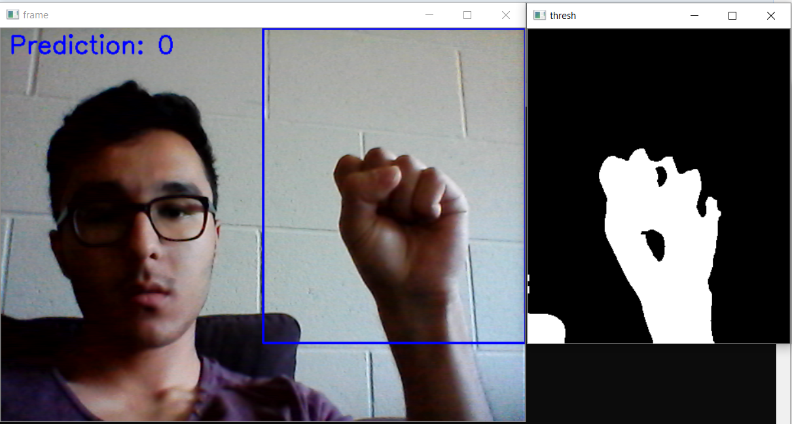
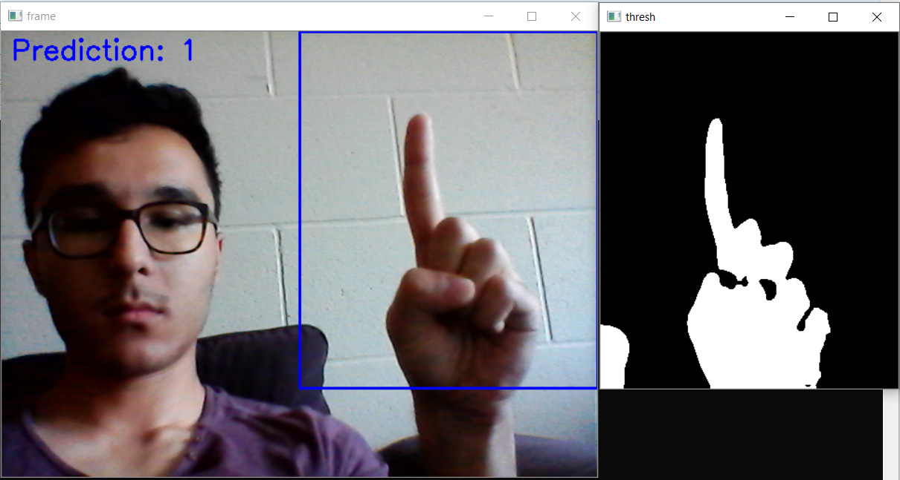
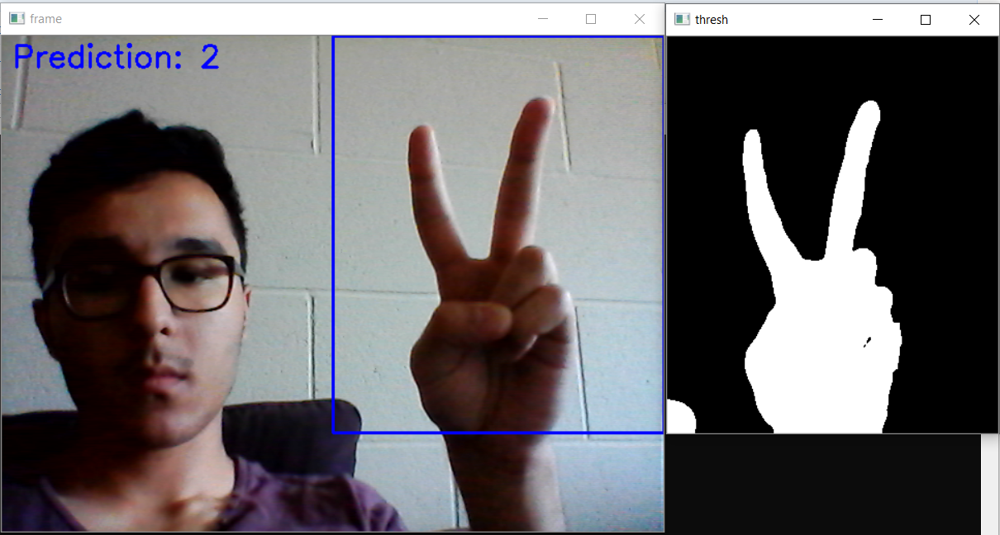
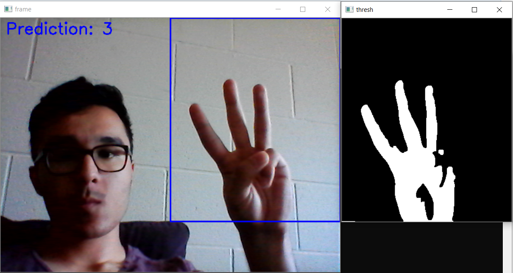
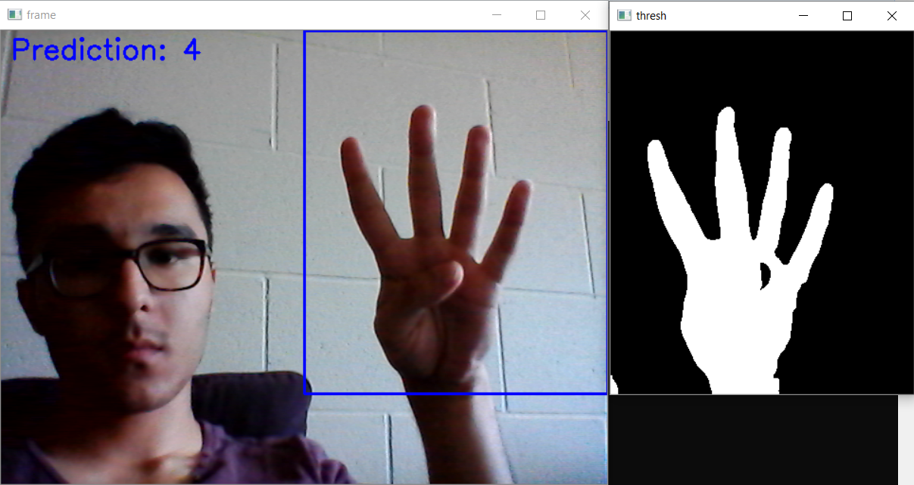
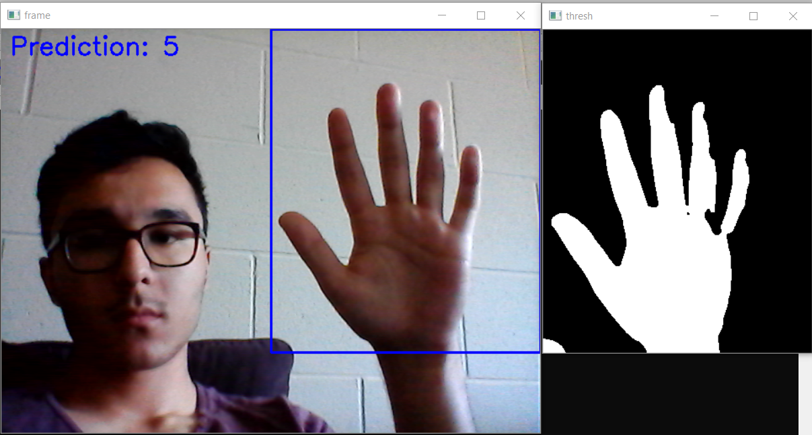
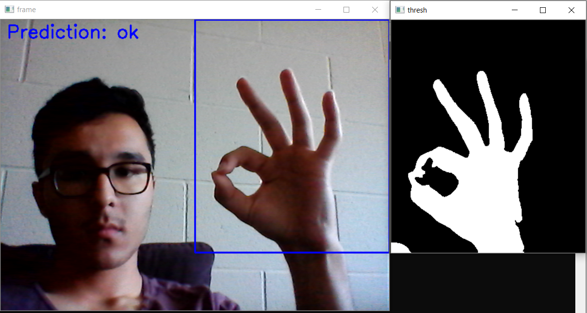
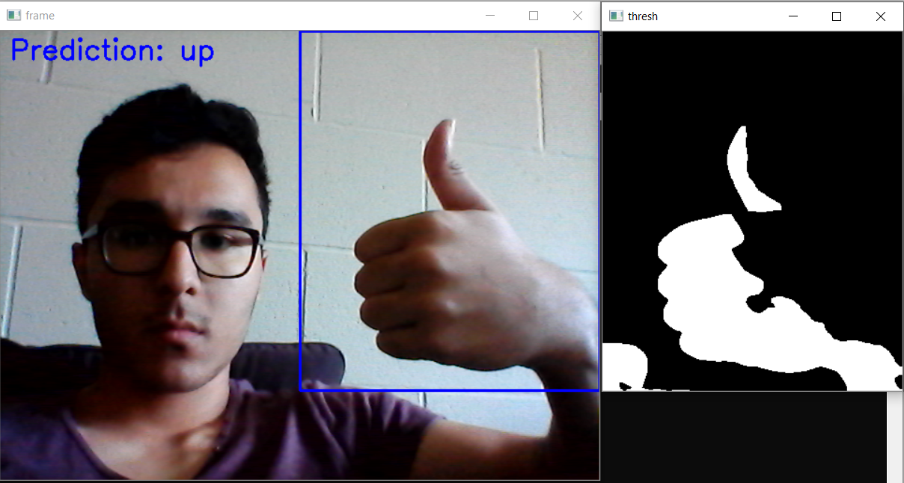
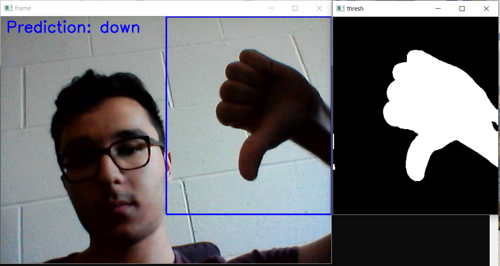

# Hand Sign Detector using Binary Image Thresholding and a Convolutional Neural Network

This project was developed using Python 3.7.4, OpenCV 4.1.0, Keras 2.2.5, and TensorFlow 1.14.0.

### Usage
1. Run
``
python HandSignDetector.py
``
2. Place your hand in the region of interest (blue rectangle)
3. Start detecting!

### Demo
| Zero | One | Two | Three | Four | Five | Ok | Up | Down |
| --- | --- | --- | --- | --- | --- | --- | --- | --- |
|  |  |  |  |  |  |  |  |  |

## References
1. ChinHuan/finger-detection: https://github.com/ChinHuan/finger-detection/blob/master/README.md
2. Opencv python hand gesture recognition: http://creat-tabu.blogspot.com/2013/08/opencv-python-hand-gesture-recognition.html
3. Image Thresholding: https://docs.opencv.org/3.4.0/d7/d4d/tutorial_py_thresholding.html
